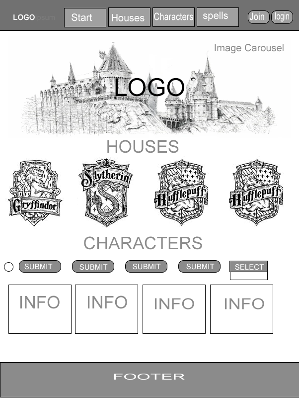
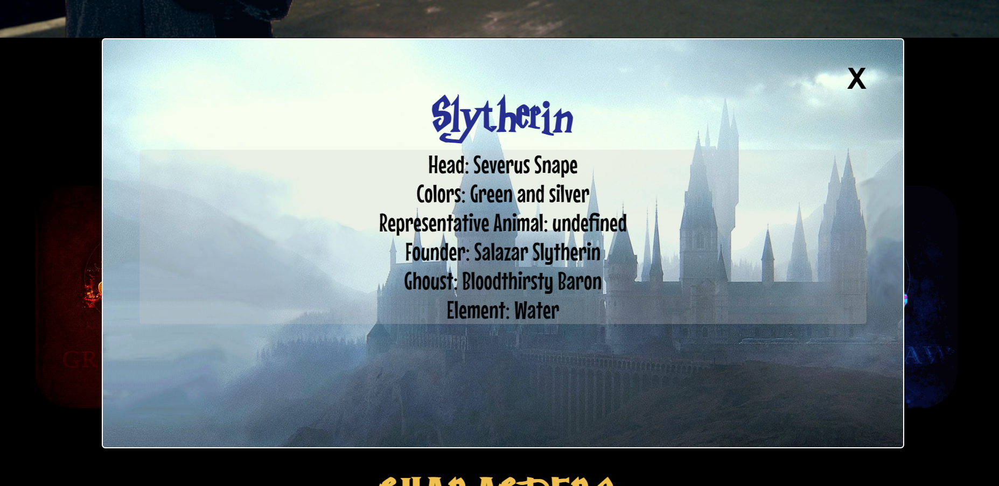
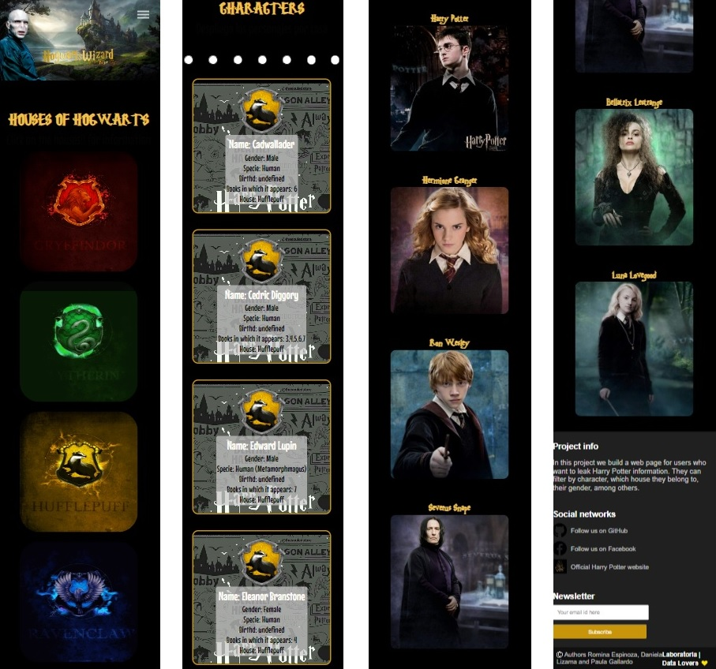
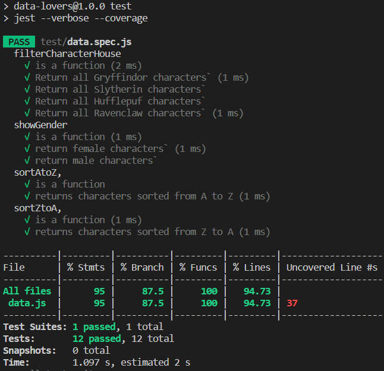

# :sparkles: DATA LOVERS - HOGWARTZ WIZARDS :sparkles:

## ABOUT THIS PROYECT :sparkles:

El sitio **_HogwartzWizard_** permite al usuario obtener información filtrada acerca del universo de Harry Potter. 

- Link proyecto: [Ir al Sitio](https://seabird15.github.io/SCL021-data-lovers/)

## :sparkles: HISTORIAS DE USUARIO  

### 1.- Como usuario principiante me gustaria que al seleccionar una casa de Hogwartz me muestre diferentes datos de interes sobre la misma:

| Criterio de aceptación                                  | Terminado                                                             |
|---------------------------------------------------------|-----------------------------------------------------------------------|
| 1.Se visualizan botones mediante el logo de cada casa   | Crear botones con el logo de cada casa                                |
| 2.Al hacer click se despliega la información de la casa | Se crea ventana modal con la info de la casa                          |
| 3.Tener una data con la información de cada casa        | Extraer desde la data la información necesaria según el logo apretado |

### 2.- Como usuario principiante me gustaria poder ver los personajes que pertenecen a cada casa
| Criterio de aceptación                                                          | Terminado                                                           |
|---------------------------------------------------------------------------------|---------------------------------------------------------------------|
| 1- Mediante un botón se muestran los personajes                                 | Se crea un botón que permite filtrar los personajes por casa        |
| 2- Dentro de la info de cada personaje se muestra el logo de su respectiva casa | Se crea una imagen para hacer mas descriptivo al momento de filtrar |

### 3.- Como usuario principiante me gustaría poder ver todos los personajes que son mujer y todos los personajes que son hombres
| Criterio de aceptación                                               | Terminado                                                                  |
|----------------------------------------------------------------------|----------------------------------------------------------------------------|
| 1- Mediante un selector se puede elegir el género de los personajes  | Se crea un select con dos opciones para filtrar por genero "Male o Female" |
| 2- Al apretar un selector se cambia por cada género                  | Al seleccionar la opción se ejecuta la función de filtrado "showGender"    |

### 4.- Como usuario principiante me gustaria poder filtrar en orden alfabético los personajes y tambien por cada casa

| Criterio de aceptación                                                                         | Terminado                                                                   |
|------------------------------------------------------------------------------------------------|-----------------------------------------------------------------------------|
| 1- Mediante un selector se puede elegir el orden alfabético de manera ascendente o descendente | Se crea un select con dos opciones de filtrado "A-Z" y "Z-A"                |
| 2- Permite ordenar alfabéticamente los nombres de los personajes de cada casa                  | Se ejecuta la función que ordena alfabéticamente según la casa seleccionada |
|                                                                                                |                                                                             |
## :sparkles: INTERFAZ DE USUARIO 
### PROTOTIPO DE BAJA FIDELIDAD

### PROTOTIPO DE ALTA FIDELIDAD

- Link Prototipo: [Ir al Sitio](https://www.figma.com/proto/lKn0uDFyhiA8eBR6iqLzky/Untitled?node-id=54%3A41&scaling=scale-down-width&page-id=0%3A1&starting-point-node-id=2%3A2)

## :sparkles: PRODUCTO FINAL 
### VERSIÓN PC

### MODELO RESPONSIVE

## :sparkles: TEST UNITARIOS 

